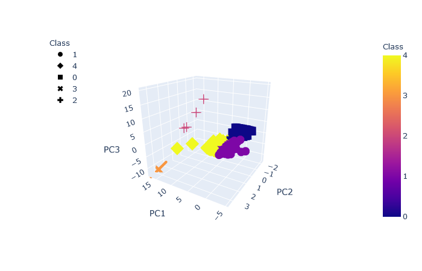
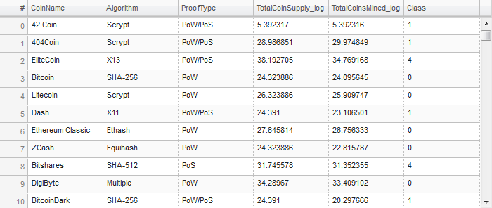

# Cryptocurrencies

The bank "Accountability Accounting" is interested in offering a new cryptocurrencies investment portfolio for its customers.
This analysis using unsupervised machine learning aims to produce a report of what cryptocurrencies are on the trading market and how cthey could be grouped toward creating a classification for developing this new investment product.

# Goals:

- Prepare the data for dimensions reduction with PCA and clustering using K-means.
- Reduce data dimensions using PCA algorithms from sklearn.
- Predict clusters using cryptocurrencies data using the K-means algorithm form sklearn.
- Create some plots and data tables to present your results.

# Progress report

1) Using PCA and unsupervised machine learning, 5 Clusters were predicted using K-means.

 

 Next, all the cryptocurrencies were tagged acordingly in a table.

  

